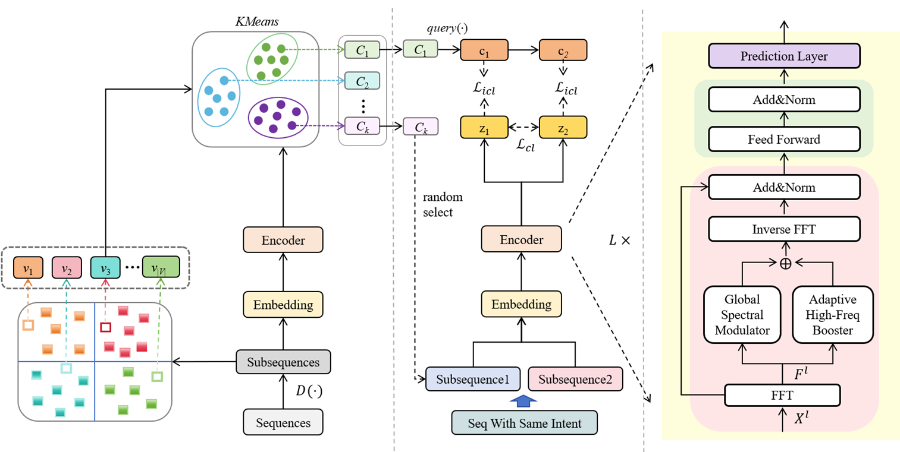

# ICFRec

This is our Pytorch implementation for the paper: "**ICFRec: Intent Contrastive Sequential Recommendation with Frequency-Domain Modeling and Cross-User Augmentation**".
The full repository will be released upon acceptance.

## Environment  Requirement

* torch\==1.7.0
* numpy\==1.19.1
* scipy\==1.5.2
* tqdm\==4.48.2

## Model Overview



## How to run

```
python main.py --data_name Beauty --alpha 0.2 --beta 0.1 --f_neg --intent_num 512  --temperature 0.7
```

## Acknowledgment

- The structure of this code is based on ICSRec. Thanks for their excellent work!


